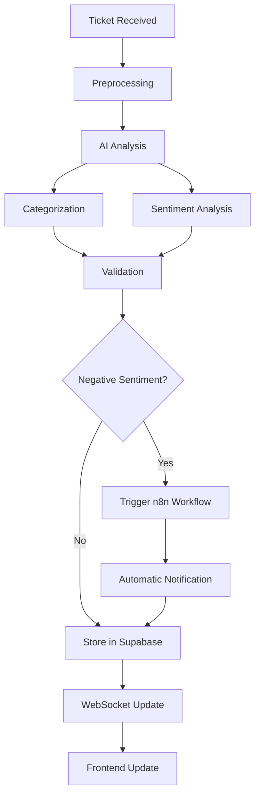

# 🤖 AI-Powered Support Co-Pilot - Backend API

[](https://python.org)
[](https://fastapi.tiangolo.com)
[](https://langchain.com)
[](https://supabase.com)

## 🚀 Project Description

The **AI-Powered Support Co-Pilot** is an innovative solution that revolutionizes support ticket management through artificial intelligence. This backend microservice uses advanced language models to automate categorization and sentiment analysis of support tickets in real-time.

### ✨ Key Features

- **🧠 Intelligent Analysis**: Automatic ticket processing using LangChain and LLM models
- **📊 Automatic Categorization**: Smart classification into categories (Technical, Billing, Commercial, etc.)
- **😊 Sentiment Analysis**: Sentiment detection (Positive, Neutral, Negative) for prioritization
- **⚡ Real-Time Processing**: Instant processing with automatic notifications
- **🔒 Security**: Robust authentication and security middleware
- **📡 WebSockets**: Bidirectional communication for real-time updates

### 🏗️ Technical Architecture

```
┌─────────────────┐    ┌──────────────────┐    ┌─────────────────┐
│   Frontend      │    │   FastAPI        │    │   Supabase      │
│   Dashboard     │◄──►│   Backend        │◄──►│   Database      │
└─────────────────┘    └──────────────────┘    └─────────────────┘
                              │
                              ▼
                       ┌──────────────────┐
                       │   LangChain      │
                       │   AI Engine      │
                       └──────────────────┘
                              │
                              ▼
                       ┌──────────────────┐
                       │   n8n Workflow  │
                       │   Automation     │
                       └──────────────────┘
```

## 🛠️ Technologies Used

- **Framework**: FastAPI 0.104+
- **AI/ML**: LangChain, Hugging Face Transformers
- **Database**: Supabase (PostgreSQL)
- **Authentication**: JWT Tokens
- **Communication**: WebSockets for real-time
- **Deployment**: Render.com / Railway.app
- **Containers**: Docker (optional)

## 🚀 Installation and Setup

### Prerequisites

- Python 3.9 or higher
- pip (Python package manager)
- Supabase account
- LLM API key (OpenAI, Hugging Face, etc.)

### 1. Clone Repository

```bash
git clone https://github.com/EstebanR05/AI_powered_support_co_pilot.git
cd AI_powered_support_co_pilot/python-api
```

### 2. Create Virtual Environment

```bash
# Create virtual environment
python -m venv venv

# Activate virtual environment
# On Linux/Mac:
source venv/bin/activate
# On Windows:
# venv\Scripts\activate
```

### 3. Install Dependencies

```bash
pip install fastapi uvicorn langchain supabase python-multipart python-jose[cryptography] passlib[bcrypt] websockets python-dotenv openai transformers torch
```

### 4. Environment Variables Configuration

Create a `.env` file in the project root:

```env
# Supabase Configuration
SUPABASE_URL=your_supabase_project_url
SUPABASE_KEY=your_supabase_anon_key
SUPABASE_SERVICE_KEY=your_supabase_service_key

# AI Model Configuration
OPENAI_API_KEY=your_openai_api_key
# Or for Hugging Face:
HUGGINGFACE_API_TOKEN=your_huggingface_token

# Application Configuration
SECRET_KEY=your_super_secret_jwt_key
ALGORITHM=HS256
ACCESS_TOKEN_EXPIRE_MINUTES=30

# Environment
ENVIRONMENT=development
```

### 5. Run Server

#### Option A: Start Script (Recommended)
```bash
chmod +x run_server.sh
./run_server.sh
```

#### Option B: Direct Command
```bash
uvicorn main:app --reload --host 0.0.0.0 --port 8000
```

The server will be available at: `http://localhost:8000`

### 6. Verify Installation

Visit `http://localhost:8000/docs` to see the interactive Swagger UI documentation.

## 📋 Main Endpoints

### 🎫 Ticket Processing

#### `POST /process-ticket`
Processes a support ticket using AI for categorization and sentiment analysis.

**Request Body:**
```json
{
  "ticket_id": "uuid",
  "description": "User reports problems with monthly billing"
}
```

**Response:**
```json
{
  "ticket_id": "uuid",
  "category": "Billing",
  "sentiment": "Negative",
  "confidence": 0.95,
  "processed": true,
  "processing_time": "1.2s"
}
```

### 🔐 Authentication

#### `POST /auth/login`
User authentication for API access.

#### `POST /auth/register`
Register new users in the system.

### 📊 Monitoring

#### `GET /health`
Health check endpoint for service monitoring.

#### `WS /ws`
WebSocket connection for real-time updates.

## 🧠 Prompt Engineering Strategy

### Classification Methodology

Our system uses a sophisticated **prompt engineering** strategy to ensure maximum accuracy in categorization and sentiment analysis:

#### 1. **Structured Classification Template**
```python
CLASSIFICATION_PROMPT = """
You are an assistant specialized in support ticket analysis.
Analyze the following ticket and return a JSON with exact categorization.

Available categories:
- Technical: Functionality problems, errors, bugs
- Billing: Charges, payments, invoices, prices
- Commercial: Sales, products, general information
- Support: Usage queries, guides, tutorials

Available sentiments:
- Positive: Satisfied, grateful customer
- Neutral: Informational query without emotions
- Negative: Frustration, anger, dissatisfaction

TICKET: "{ticket_description}"

RESPONSE (JSON only):
"""
```

#### 2. **Dual Validation**
- **Primary Model**: Initial analysis with GPT-4/Claude
- **Secondary Model**: Validation with local model for consistency
- **Confidence System**: Confidence score based on model coherence

#### 3. **Dynamic Contextualization**
- **Pattern History**: Learning from common customer patterns
- **Temporal Adjustment**: Adaptation based on schedules and days (higher urgency during business hours)
- **Intelligent Escalation**: Automatic detection of critical tickets

## 🔄 Processing Flow



## 🌐 Production Deployment

### Render.com (Recommended)

1. **Create new Web Service**
2. **Connect GitHub repository**
3. **Configure environment variables**
4. **Automatic deployment**

```yaml
# render.yaml
services:
  - type: web
    name: ai-support-copilot-api
    env: python
    buildCommand: "pip install -r requirements.txt"
    startCommand: "uvicorn main:app --host 0.0.0.0 --port $PORT"
    healthCheckPath: /health
```

### Railway.app (Alternative)

```bash
# Install Railway CLI
npm install -g @railway/cli

# Login and deploy
railway login
railway init
railway up
```

### Docker (Optional)

```dockerfile
FROM python:3.9-slim

WORKDIR /app

COPY requirements.txt .
RUN pip install --no-cache-dir -r requirements.txt

COPY . .

EXPOSE 8000

CMD ["uvicorn", "main:app", "--host", "0.0.0.0", "--port", "8000"]
```

## 🧪 Testing

### Run Tests
```bash
pytest tests/ -v
```

### Coverage
```bash
pytest --cov=src tests/
```

## 📈 Monitoring and Logs

- **Health Checks**: `/health` endpoint for monitoring
- **Metrics**: Processing time, success rate
- **Structured Logs**: JSON logging for analysis
- **Alerts**: Integration with monitoring systems

## 🤝 Contributing

1. Fork the project
2. Create a feature branch (`git checkout -b feature/AmazingFeature`)
3. Commit your changes (`git commit -m 'Add some AmazingFeature'`)
4. Push to the branch (`git push origin feature/AmazingFeature`)
5. Open a Pull Request

## 📄 License

This project is under the MIT License - see [LICENSE.md](LICENSE.md) for details.

## 👨‍💻 Author

**Esteban Rodriguez** - [@EstebanR05](https://github.com/EstebanR05)

## 🆘 Support

If you have any questions or issues:

- 📧 Email: support@ai-copilot.com
- 🐛 Issues: [GitHub Issues](https://github.com/EstebanR05/AI_powered_support_co_pilot/issues)
- 📖 Documentation: [Project Wiki](https://github.com/EstebanR05/AI_powered_support_co_pilot/wiki)

---

⭐ **If this project is useful to you, don't forget to give it a star on GitHub!**

## 🎯 Future Roadmap

- [ ] **Integration with more LLMs** (Claude, Gemini)
- [ ] **Advanced Emotion Analysis** (8+ categories)
- [ ] **Auto-resolution of Simple Tickets**
- [ ] **Advanced Analytics Dashboard**
- [ ] **Intelligent API Rate Limiting**
- [ ] **Multi-language Support** (ES, EN, PT)
